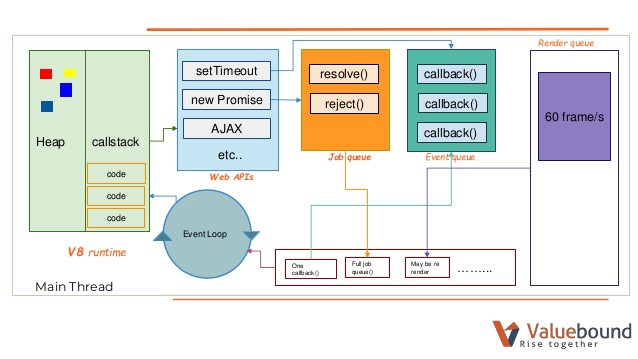

# Node JS

## Is Node.js a language or a framework?

Chrome’s V8 often called an engine, is a package deal containing an interpreter, compiler, runtime implementation compatible with the runtime interface demanded by the ECMA standard JavaScript conventions.

Nodejs is not a framework(or a language) but a JavaScript runtime built on Chrome’s V8 JavaScript engine. It extends the power of handling file and network I/O with a preference for asynchronous patterns after including everything that is Javascript.

Node.js expands the JavaScript language by providing a larger set of runtime environment primitives — those which are outside the scope of ECMA’s standards. These include things like file handling, network I/O, etc. Javascript does not come equipped with these because for security reasons, javascript originally did not include file I/O for use in the browser. And, it did not need to do networking tasks, because the browser does them.

## Is Node.js Single-threaded and is it Synchronous or Asynchronous? Can you describe what is an event loop? Can you explain how Node.js handles multiple requests concurrently despite being single-threaded?

Node.js is Single-threaded( actually hybrid, more on this later) and Asynchronous.

JavaScript executes all operations on a single thread, but using a few smart data structures, gives us the illusion of multi-threading.
There is an event queue that uses a queue data structure that is responsible for sending new functions to the track for processing.
Whenever an async function is called, it is sent to a browser API. These are APIs built into the browser. Based on the command received from the call stack, the API starts its own single-threaded operation.

You can take any number of examples like the `setTimeout` method, Axios methods, or any other method that run asynchronously. let’s take the setTimeout operation and look into its lifecycle. When a `setTimeout` is called, it is processed in the stack and then sent to the corresponding API which waits till the specified time to send this operation back in for processing.

Where does it send the operation? The event queue. Hence, we have a cyclic system for running async operations in JavaScript. The language itself is single-threaded, but the browser APIs act as separate threads.

The event loop facilitates this process; it constantly checks whether or not the call stack is empty. If it is empty, new functions are added from the event queue. If it is not, then the current function call is processed.

One good question here is that if you call setTimeOut with 0ms and resolve a promise immediately, which would console log first? The answer is Promises and the reason is that Job queue gets more priority than Event Queue.

So, How does Nodejs handle multiple requests concurrently despite being Single-threaded? - There is one process, multiple threads, but only one thread dedicated to parsing and executing javascript code. the other threads are started from C++ bindings called from the JS.

Node isn’t the best choice for applications that mostly deal with CPU-intensive computing(but worker threads are a choice here). On the other hand, it excels at handling multiple I/O requests.

Think of NodeJS as a waiter taking the customer's orders while the I/O chefs prepare them in the kitchen. Other systems have multiple chefs, who take a customer's order, prepare the meal, clear the table and only then attend to the next customer.
